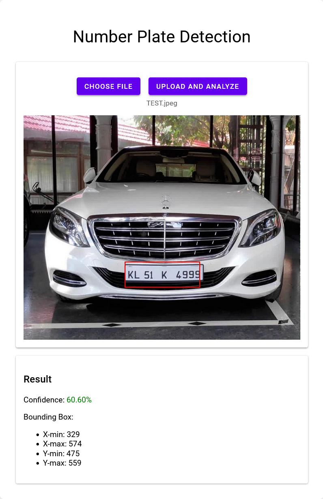

# Number Plate Recognition

This project implements a deep learning model to detect and recognize number plates in images. It includes a data preprocessing pipeline, model training scripts in a Jupyter notebook, and a Flask web application for easy deployment and usage.



## Project Structure

- `Number_Plate_Recognition.ipynb`: Main Jupyter notebook for data preprocessing, model training, and evaluation (to be run in Google Colab)
- `app/app.py`: Flask web application for serving predictions
- `app/templates/index.html`: HTML template for the web interface
- `Dockerfile`: Instructions for building the Docker image

**Note:** The trained model file `Number-Plate-Recognition.keras` is not included in this repository due to GitHub's file size limitations. You will need to generate this file by running the Jupyter notebook, or download it from an external source if provided.

## Features

- Data loading and preprocessing from Kaggle dataset
- CNN model architecture for number plate detection
- Model training with custom layers
- Evaluation metrics and visualizations
- Flask web application for easy deployment
- Docker support for containerized deployment

## Prerequisites

- Google Colab account
- Kaggle account (for dataset access)
- Python 3.12+
- TensorFlow 2.x
- Flask
- Pillow
- NumPy
- Docker (for containerized deployment)

## Installation

1. Clone this repository:
   ```
   git clone https://github.com/pouryare/number-plate-recognition.git
   cd number-plate-recognition
   ```

2. Open the `Number_Plate_Recognition.ipynb` notebook in Google Colab.

3. Ensure you have a Kaggle account and API token set up. If not, follow these steps:
   - Create a Kaggle account at https://www.kaggle.com
   - Go to your account settings and create a new API token
   - Download the `kaggle.json` file

4. Upload the `kaggle.json` file to your Google Drive in the appropriate directory (as specified in the notebook).

## Usage

### Training the Model

1. Open the `Number_Plate_Recognition.ipynb` notebook in Google Colab.
2. Run all cells in the notebook sequentially. This will:
   - Mount your Google Drive
   - Set up the Kaggle API
   - Download the dataset
   - Preprocess the images
   - Create and train the number plate detection model
   - Evaluate the model and display performance metrics
   - Save the trained model as `Number-Plate-Recognition.keras`

### Running the Web Application

#### Local Deployment

To run the Flask web application locally:

1. Ensure you have the required packages installed:
   ```
   pip install -r requirements.txt
   ```

2. Place the `Number-Plate-Recognition.keras` file in the `app` directory.

3. Navigate to the `app` folder:
   ```
   cd app
   ```

4. Run the Flask app:
   ```
   python app.py
   ```

5. Open a web browser and go to `http://localhost:8080` to use the prediction interface.

#### Docker Deployment

You can deploy the web application using Docker:

```
docker pull pouryare/number-plate-recognition:latest
docker run -p 8080:8080 pouryare/number-plate-recognition:latest
```

After running these commands, open a web browser and go to `http://localhost:8080` to use the prediction interface.

## Model Architecture

The project uses a Convolutional Neural Network (CNN) based on InceptionResNetV2 for number plate detection. Detailed architecture information can be found in the `Number_Plate_Recognition.ipynb` notebook.

## Dataset

This project uses the "Number Plate Detection" dataset from Kaggle. You can find the dataset [here](https://www.kaggle.com/datasets/aslanahmedov/number-plate-detection).

## Performance

The model is evaluated using metrics such as Mean Absolute Error (MAE) and visualizations of predicted bounding boxes. Detailed performance metrics and visualizations are generated during the evaluation phase in the Colab notebook.

## Contributing

Contributions to this project are welcome! Please fork the repository and submit a pull request with your proposed changes.

## License

This project is licensed under the MIT License - see the [LICENSE](LICENSE) file for details.

## Acknowledgments

- Dataset: [Number Plate Detection](https://www.kaggle.com/datasets/aslanahmedov/number-plate-detection) by Aslan Ahmedov
- Inspired by various object detection projects in the computer vision domain

## Disclaimer

This project is for educational and research purposes only. It should not be used as a definitive tool for number plate recognition in real-world scenarios without further validation and testing.
